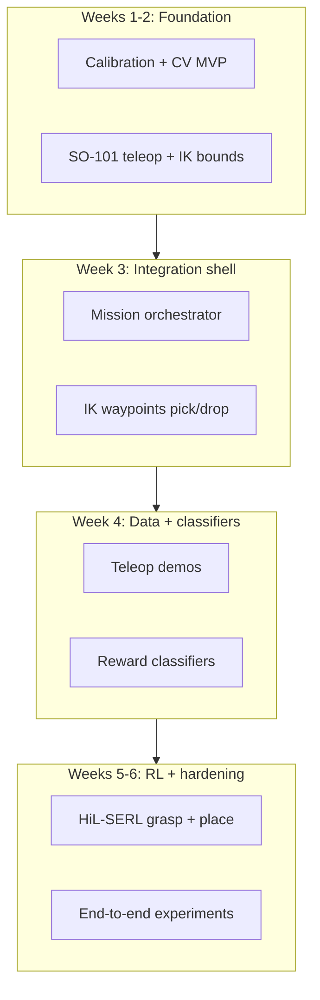

# Full System Build Plan: CV → SO-101 → HiL-SERL

A **6-week plan** (30 working days) for building a pick-and-place system with overhead CV, SO-101 arm, and LeRobot HiL-SERL. Adjust pace if part-time; merge days if you already know robotics or Python.

## System Overview



**Final integration:** one Python **orchestrator** calls CV → IK → LeRobot grasp → IK → LeRobot place, with experiment YAML for drop pose.

### Hybrid control split

| Step | Implementation |
|------|----------------|
| Get pick from CV | Your Python node (priority queue) |
| Move to pre-pick | IK / waypoints from pick coordinates |
| Fine approach + grasp | HiL-SERL segment (wrist + overhead, ~15–20 s) |
| Move to pre-drop | IK from `drop_pose` in experiment YAML |
| Place + release | Second HiL-SERL segment |

Coarse motion uses **known coordinates** from CV and config. RL handles **contact-rich** behavior (alignment, grasp force, release).

---

## Before You Start (Inventory)

| Piece | You need |
|-------|----------|
| Hardware | SO-101 follower + leader (or gamepad), overhead camera, wrist camera, fixed mount |
| Software | LeRobot with `[hilserl]` extra, SO-101 URDF, NVIDIA GPU for RL training |
| CV / detection | [Roboflow](https://roboflow.com) account, Ultralytics (`pip install ultralytics`) for local YOLO inference |
| Docs | [HiL-SERL guide](https://huggingface.co/docs/lerobot/hilserl), [Roboflow YOLO export](https://docs.roboflow.com/deploy/export/yolov8), `lerobot/rl/gym_manipulator.py` |
| Custom code | `cv_service/` (homography + YOLO detect), `mission/`, `orchestrator.py` (you implement) |

---

## What to Study (By Topic)

Study in parallel with the week they appear.

| Topic | Why | Resources |
|-------|-----|-----------|
| LeRobot + SO-101 | Teleop, record, motors | `lerobot-teleoperate`, `lerobot-setup-motors`, HiL-SERL docs |
| OpenCV + homography | Pixel → table XY | OpenCV `findHomography`, perspective transform |
| Roboflow + YOLO | Sample detection (primary) | Roboflow label/train → export YOLOv8 → Ultralytics `predict` |
| Robot frames | Pick/drop in consistent coordinates | Kinematics primer + SO-101 URDF |
| LeRobot IK / EE control | Waypoints + HiL-SERL | `lerobot-find-joint-limits`, `inverse_kinematics` in env config |
| `gym_manipulator` flow | Demos + RL segments | `make_robot_env`, `make_processors`, `control_loop`, `actor.py` |
| Reward classifier + SAC | Automated success + online RL | HiL-SERL classifier + actor/learner sections |
| Human-in-the-loop RL | When to intervene | HiL-SERL intervention guide; Luo et al. 2024 (skim) |

---

## Week 1 — Vision + Coordinates (No RL)

**Goal:** Overhead CV returns `(x, y)` in table frame + class + priority; verified on saved images.

**Detection method:** Roboflow → train YOLO → local Ultralytics inference. Homography maps box centers to table meters. Workspace mask filters detections outside the calibrated quad.

| Day | Study (1–2 h) | Implement | Deliverable |
|-----|---------------|-----------|-------------|
| 1 | Camera geometry, homography | Fix overhead camera; document lighting | `data/calib/images/` |
| 2 | OpenCV homography | 4-point calibration; save `H` to JSON; ruler-check | `config/table_homography.json` |
| 3 | Roboflow dataset | Capture 80–150 overhead images; upload; label boxes (class `cap` for v1) | Roboflow project v1 |
| 4 | Roboflow train + export | Train on Roboflow; export **YOLOv8**; download `best.pt` | `models/cap_v1/weights/best.pt` |
| 5 | `detect_yolo.py` | Ultralytics predict → box center `(u,v)`; workspace filter; wire `H` | `cv_service/detect_yolo.py` |
| 6 | Confidence + stability | `conf` threshold; optional multi-frame median; ruler error log | Stable `(x_m, y_m)` per cap |
| 7 | **Checkpoint** | CLI: `python -m cv_service.run --image test.jpg` | **CV MVP** |

**Connects later:** `orchestrator` calls `cv_service.get_next_pick()` → `{x_m, y_m, z_approach, class, priority}`.

### Week 1 — Roboflow quick reference (v1: one cap type)

1. **Create project** — Object Detection, single class: `cap`.
2. **Capture images** — Same camera/lighting as homography; include: 1 cap, many caps, center/edges/corners, 10–20 **empty table** images.
3. **Label** — Tight box around each visible cap (label every instance in every image).
4. **Augment** (Roboflow defaults OK) — flip, brightness, blur; train/valid/test split ~70/20/10.
5. **Train** — Roboflow Train or export dataset + `yolo train` locally.
6. **Export** — Format: YOLOv8. Place weights in `models/cap_v1/`.
7. **Integrate** — Box center → `pixel_to_table(u, v, H)`; reject if center outside workspace polygon.

**Adding cap colors later (v2):** add a new class per color in Roboflow (e.g. `cap_red`, `cap_blue`), label new images, retrain → `cap_v2/best.pt`. Homography unchanged unless camera moves.

---

## Week 2 — SO-101 + Workspace (No CV)

**Goal:** Arm moves safely; teleop works; EE bounds and drop pose in config.

| Day | Study | Implement | Deliverable |
|-----|---------|-----------|-------------|
| 8 | LeRobot SO-101 setup | `lerobot-setup-motors`; connect follower + leader | Reliable connection |
| 9 | `lerobot-teleoperate` | Leader teleop; both cameras in robot config | Live wrist + overhead |
| 10 | URDF + joint limits | `lerobot-find-joint-limits` over pick + drop areas | `end_effector_bounds` |
| 11 | HiL-SERL config layout | Draft experiment YAML | `mission/experiment.yaml` |
| 12 | IK / EE waypoints | Script: home, pick hover, drop hover | `mission/ik_moves.py` |
| 13 | Safety | `max_relative_target`, estop, slow speeds | Safety checklist |
| 14 | **Checkpoint** | Manual full pick + place (no CV) | **~60–90 s cycle by hand** |

**Connects later:** `ik_moves.move_pre_pick(x, y)` and `move_pre_drop(drop_pose)` replace manual transit.

---

## Week 3 — Orchestrator Shell (CV + IK, No RL)

**Goal:** Automated CV pick → IK hover → manual grasp → IK to drop hover.

| Day | Study | Implement | Deliverable |
|-----|---------|-----------|-------------|
| 15 | State machines | `orchestrator.py`: IDLE → PICK_HOVER → … | State diagram |
| 16 | LeRobot robot API | Move follower to CV hover via IK script or API | Arm tracks CV target |
| 17 | Failure handling | CV retry; IK abort; stale detection | Error paths |
| 18 | Experiment config | Load `drop_pose` from YAML; `--experiment exp_01` | Swap drop without code change |
| 19 | Logging | Per-job log: coords, timing, success | `logs/mission_*.jsonl` |
| 20 | Debug | Save wrist frame at hover | Per-job debug images |
| 21 | **Checkpoint** | CV → pre-pick → teleop grasp → pre-drop | **End-to-end shell** |

**Day 21 flow:**

```
overhead cam → cv_service → (x, y)
experiment.yaml → drop_pose
orchestrator → ik_moves(pre_pick) → [teleop grasp] → ik_moves(pre_drop)
```

---

## Week 4 — LeRobot Data (Demos, Crops, Classifiers)

**Goal:** Two datasets + two reward classifiers (grasp / place).

| Day | Study | Implement | Deliverable |
|-----|---------|-----------|-------------|
| 22 | `gym_manipulator` record mode | `env_config_grasp.json`: SO-101, IK, 2 cams, `control_time_s≈20` | Config files |
| 23 | Grasp demos | Record 15–20 episodes from pre-pick hover | Dataset `…/grasp_topdown` |
| 24 | Place demos | Record 15–20 episodes (holding object → drop) | Dataset `…/place_topdown` |
| 25 | ROI cropping | `python -m lerobot.rl.crop_dataset_roi` | `crop_params_dict` |
| 26 | Grasp classifier | `lerobot-train` reward classifier (lifted = success) | `classifier_grasp/` |
| 27 | Place classifier | Train place success (in drop zone, gripper open) | `classifier_place/` |
| 28 | **Checkpoint** | Live test classifiers via `gym_manipulator` | **Automated success signal** |

**Connects:** `env.processor.reward_classifier.pretrained_path` per segment.

For classifier data collection, use `terminate_on_success: false` to get more positive frames; use `true` during RL.

---

## Week 5 — HiL-SERL Training

**Goal:** SAC policies for grasp and place with human interventions.

| Day | Study | Implement | Deliverable |
|-----|---------|-----------|-------------|
| 29 | SAC + actor/learner | `train_config_grasp.json`; start learner | Learner running |
| 30 | Interventions | Actor + learner; gamepad/leader corrections | Grasp policy v0 |
| 31 | Evaluate grasp | Success rate from hover; WandB intervention rate | More demos or continue |
| 32 | Place policy | `train_config_place.json`; second SAC | Place policy v0 |
| 33 | Hyperparameters | `temperature_init`, `policy_parameters_push_frequency`, `storage_device` | Stable training |
| 34 | **Checkpoint** | Orchestrator runs **RL grasp** in mission loop | **RL grasp integrated** |

Commands:

```bash
python -m lerobot.rl.learner --config_path configs/train_sac_grasp.json
python -m lerobot.rl.actor   --config_path configs/train_sac_grasp.json
```

---

## Week 6 — End-to-End + Hardening

**Goal:** Full autonomous cycle; robust CV; experiment changes.

| Day | Study | Implement | Deliverable |
|-----|---------|-----------|-------------|
| 35 | System timing | CV → IK → RL grasp → IK → RL place | Full autonomous cycle |
| 36 | CV v2 | Collect failure frames; add classes or hard negatives; retrain YOLO (`cap_v2`) | Robust detection |
| 37 | Recovery | Retry pick; human reset; re-queue | 10-run reliability test |
| 38 | Experiment swap | New YAML `drop_pose` only | Experiment change drill |
| 39 | Documentation | README: architecture, runbook | Team handoff |
| 40 | **Final checkpoint** | 10+ consecutive pick–place jobs | **System v1.0** |

---

## Final Architecture

```
┌─────────────────────────────────────────────────────────────────┐
│                     orchestrator.py                              │
│  load experiment.yaml → drop_pose, offsets, classifier paths     │
└───────────────────────────┬─────────────────────────────────────┘
                            │
     ┌──────────────────────┼──────────────────────┐
     ▼                      ▼                      ▼
┌─────────────┐      ┌──────────────┐       ┌──────────────────┐
│ cv_service  │      │ mission/     │       │ lerobot (hilserl)│
│ detect_yolo │      │ ik_moves.py  │       │ gym_manipulator  │
│ queue.py    │      │ experiment   │       │ actor + learner  │
│ homography  │      │ .yaml        │       │ (grasp | place)  │
│ models/*.pt │      │              │       │                  │
└──────┬──────┘      └──────┬───────┘       └────────┬─────────┘
       │ pick x,y           │ waypoints               │ RL segments
       └────────────────────┴─────────────────────────┘
                            │
                     SO-101 follower
                     overhead + wrist cameras
```

### One mission cycle

1. `pick = cv_service.get_next_pick()`
2. `ik_moves.goto_pre_pick(pick.x, pick.y, z_approach)`
3. `hilserl.run_segment("grasp", config=grasp_env_config)`
4. `ik_moves.goto_pre_drop(experiment.drop_pose)`
5. `hilserl.run_segment("place", config=place_env_config)`
6. Log result; mark CV job complete

---

## Target Folder Structure

```
your_project/
├── cv_service/
│   ├── detect_yolo.py      # Ultralytics inference + workspace filter
│   ├── homography.py       # load H, pixel_to_table
│   ├── queue.py
│   ├── calibrate.py
│   └── run.py
├── models/
│   └── cap_v1/
│       ├── weights/best.pt
│       └── data.yaml         # class names (from Roboflow export)
├── data/
│   ├── images/               # local test photos
│   └── roboflow/             # optional: exported dataset zip
├── mission/
│   ├── experiment.yaml
│   └── ik_moves.py
├── configs/
│   ├── env_record_grasp.json
│   ├── env_record_place.json
│   ├── env_rl_grasp.json
│   ├── env_rl_place.json
│   ├── train_sac_grasp.json
│   └── train_sac_place.json
├── orchestrator.py
├── config/
│   ├── table_homography.json
│   └── cv_model.yaml         # path to best.pt, conf threshold
├── docs/
│   └── system-build-plan.md
└── logs/
```

---

## Configuration Examples

### `mission/experiment.yaml`

```yaml
# Drop pose changes per experiment (infrequent)
drop_pose: [0.22, -0.05, 0.04]   # x, y, z in table frame (meters)
pre_pick_offset_z: 0.10            # hover above pick
pre_drop_offset_z: 0.10
default_yaw: 0.0                 # top-down (v1)
```

### `config/cv_model.yaml`

```yaml
weights: models/cap_v1/weights/best.pt
conf: 0.5          # minimum detection confidence
imgsz: 640         # inference size (match Roboflow train size)
```

### CV pick target API

```python
PickTarget = {
    "id": str,
    "class_name": str,       # e.g. "cap" (v1); "cap_red" etc. in v2
    "confidence": float,
    "priority": float,
    "x_m": float,
    "y_m": float,
    "z_approach_m": float,
    "yaw_rad": float | None,  # None = top-down default; use later for sideways
}
```

### LeRobot env (grasp segment, sketch)

```json
{
  "mode": "record",
  "env": {
    "type": "gym_manipulator",
    "name": "real_robot",
    "fps": 10,
    "robot": { "type": "so101_follower" },
    "teleop": { "type": "so101_leader" },
    "processor": {
      "inverse_kinematics": { "urdf_path": "...", "end_effector_bounds": {} },
      "image_preprocessing": { "resize_size": [128, 128] },
      "reset": { "control_time_s": 20, "terminate_on_success": true },
      "gripper": { "use_gripper": true }
    }
  },
  "dataset": {
    "repo_id": "username/grasp_topdown",
    "task": "grasp",
    "num_episodes_to_record": 20
  }
}
```

---

## Milestone Checklist

| Week | You should be able to… |
|------|-------------------------|
| 1 | YOLO detect → table `(x, y)` within ~5 mm on test images |
| 2 | Teleop full pick + place manually on SO-101 |
| 3 | CV pick → arm moves to hover automatically |
| 4 | Classifier detects grasp/place success live |
| 5 | RL grasp from hover; interventions decreasing |
| 6 | Full CV → pick → drop with RL grasp + place |

---

## Scope Control

### Defer to v2 (after day 40)

- Sideways grasp (new demos, policy, CV yaw)
- Drop in `observation.environment_state` (only if training many drop poses)
- Single 90 s SAC episode for whole mission
- Bimanual or parallel multi-sample queue on robot

### Do not skip

- Homography calibration
- Roboflow dataset with empty-table negatives before first train
- EE bounds (`lerobot-find-joint-limits`)
- Separate grasp and place datasets + classifiers
- Short RL episodes (~15–25 s), not full 60–90 s mission

---

## Compressed Timeline

| If you have… | Merge |
|--------------|--------|
| Homography already done | Week 1 → 5 days (focus on Roboflow + integrate) |
| Robot already calibrated | Week 2 → 3 days |
| Place stays teleop initially | Save ~5 days; RL grasp only first |

**Minimum viable:** Weeks 1–3 + grasp demos, classifier, and SAC; place via teleop until grasp is solid.

---

## Daily Time Budget

| Activity | Hours/day |
|----------|-----------|
| Study | 1–2 |
| Implement + test | 4–6 |
| Logbook | 15 min |

---

## Daily Logbook Template

```text
Date:
Studied:
Built:
Integrated with:
Test result:
Blocked by:
Tomorrow:
```

---

## CV Build Notes

### Detection stack (primary)

| Layer | Tool | Role |
|-------|------|------|
| Find samples | **Roboflow → YOLOv8** (`detect_yolo.py`) | Bounding boxes → centroid `(u, v)` + class |
| Table filter | Workspace polygon from homography | Drop boxes outside calibrated quad |
| Coordinates | Homography `H` (`homography.py`) | `(u, v)` → `(x_m, y_m)` |
| Queue | `queue.py` | Sort by priority; `get_next_pick()` |

Run YOLO inference **locally** with Ultralytics next to the robot — not Roboflow cloud API per frame.

### Roboflow dataset guidelines

| Item | Guidance |
|------|----------|
| v1 classes | Single class: `cap` |
| v2+ classes | One class per cap color/type: `cap_red`, `cap_blue`, … |
| Image count | 80–150+ for v1; +30–50 instances per new class for v2 |
| Empty table | 10–20 images, no labels — reduces false positives |
| Labeling | Box tight on cap top; label **every** cap in every image |
| Export | YOLOv8 format → `best.pt` |
| Retrain | New color = new class + new labels + export new weights |

### Optional fallback

Classical HSV (`detect.py`, `tune_hsv.py`) may remain for debugging only — not the production path.

---

## References

- [LeRobot HiL-SERL documentation](https://huggingface.co/docs/lerobot/hilserl)
- [Roboflow — train and deploy YOLOv8](https://docs.roboflow.com)
- [Ultralytics YOLO](https://docs.ultralytics.com)
- Luo, J. et al. (2024). *Precise and Dexterous Robotic Manipulation via Human-in-the-Loop Reinforcement Learning.* arXiv:2410.21845
